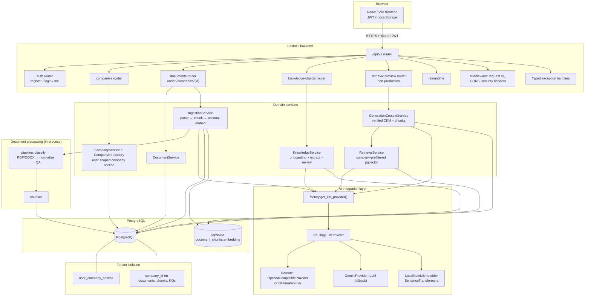
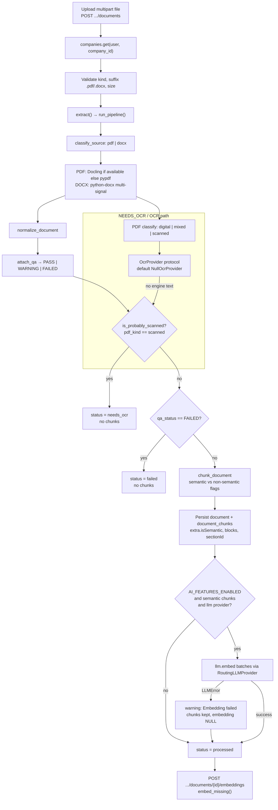
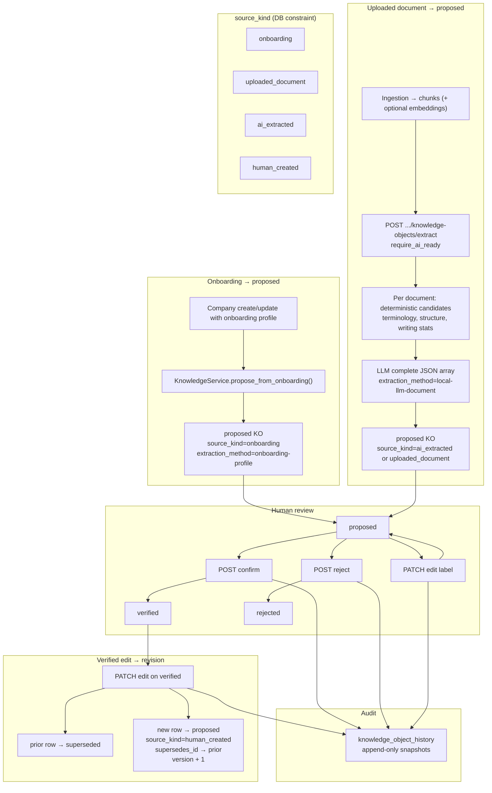
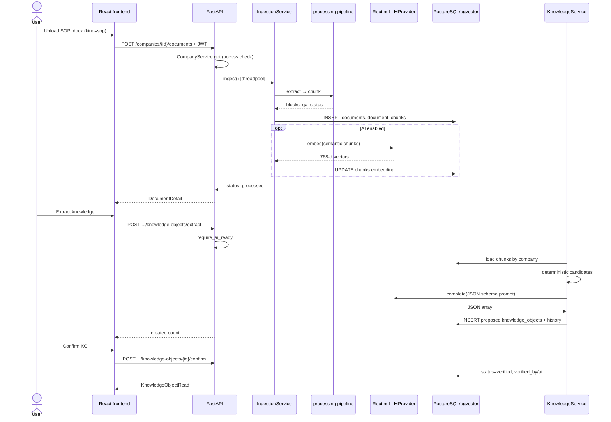
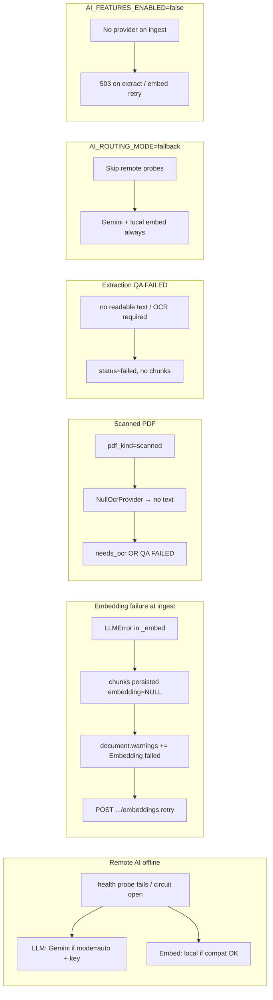
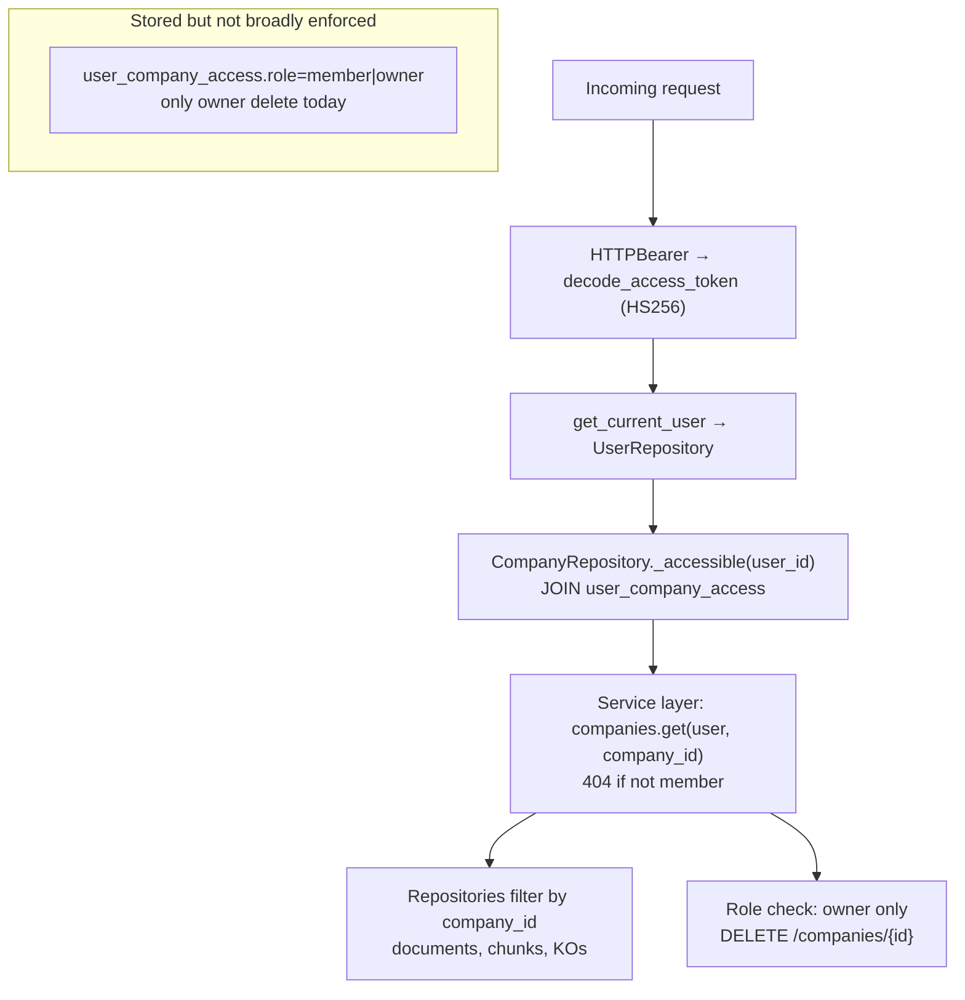

# Cybrain QS — Current System Design

**Last verified against repository:** 2026-09-21

This document describes **what is implemented in the repository today**. It is not a target or future architecture. Where product navigation or skills mention capabilities that are not wired in code (SOP generation API, public retrieval, job queues), they are called out explicitly.

---

## Scope summary

| Layer | Implemented today |
| --- | --- |
| Frontend | React 19 + Vite + TypeScript; EN/DE i18n; JWT auth; companies, onboarding, company detail (documents + CKM review); SOP wizard **step 01 only**; placeholder routes for library/knowledge/assistant/etc. |
| Backend | FastAPI; domain routers (auth, companies, documents, knowledge, AI runtime); synchronous in-request document ingestion |
| Database | PostgreSQL; SQLAlchemy + Alembic; **pgvector** on `document_chunks.embedding` (768-d) |
| CKM | `knowledge_objects` + append-only `knowledge_object_history`; proposed → confirm/reject/edit with supersession |
| SOP product | SOP **projects + Blueprint** APIs exist; no generated prose, approval, or versioning |
| Retrieval | `RetrievalService` (company-prefiltered pgvector) + `GenerationContextService` (verified CKM). Dev preview `POST .../retrieval/preview`; no SOP generator yet |
| AI | `RoutingLLMProvider`: remote OpenAI-compatible (or Ollama) + optional Gemini LLM fallback + local SentenceTransformers Nomic embeddings |

---

## 1. High-level system architecture



### SOP-related persistence (actual)

- **No** `sops`, `sop_versions`, or blueprint tables.
- **Yes:** `documents.kind` ∈ `{general, sop, template}`; `companies.sop_count`; `sop_projects` + Blueprint APIs; frontend wizard step 01 plus functional Blueprint review.

### Implementation references

| Area | Source files |
| --- | --- |
| App factory, health | `backend/app/main.py` |
| API aggregation | `backend/app/api/v1/router.py` |
| Frontend shell & routes | `frontend/src/routes/AppRoutes.tsx`, `frontend/src/services/apiClient.ts` |
| Tenant companies | `backend/app/modules/companies/repository.py`, `backend/app/modules/companies/service.py` |
| Documents & ingestion | `backend/app/modules/documents/router.py`, `backend/app/modules/documents/ingestion.py`, `backend/app/modules/documents/service.py` |
| CKM | `backend/app/modules/knowledge/router.py`, `backend/app/modules/knowledge/service.py`, `backend/app/modules/knowledge/models.py` |
| Processing | `backend/app/processing/pipeline.py`, `backend/app/processing/extractor.py`, `backend/app/processing/chunker.py` |
| AI routing | `backend/app/integrations/llm/factory.py`, `backend/app/integrations/llm/router.py` |
| Retrieval | `backend/app/modules/knowledge/retrieval.py`, `backend/app/modules/knowledge/generation_context.py`, `backend/app/modules/knowledge/retrieval_router.py` |
| SOP UI only | `frontend/src/pages/CreateSopPage.tsx`, `frontend/src/features/sops/ProjectInitializationStep.tsx` |

---

## 2. Document ingestion pipeline

Upload runs **synchronously** in the HTTP request (thread pool for CPU-bound parse). Source file bytes are **not** retained after parsing.



**QA behavior**

| Rollup | Ingestion effect |
| --- | --- |
| `FAILED` | Document row saved; **no** chunking; `status=failed` (unless stopped earlier for scanned) |
| `WARNING` | Warnings on document; **continues** to chunking |
| `PASS` | Normal path to chunking |

**Cancellation:** optional `operation_id`; in-memory cancel token can abort ingestion → `status=cancelled`.

### Implementation references

| Step | Files |
| --- | --- |
| HTTP upload | `backend/app/modules/documents/router.py` |
| Ingestion orchestration | `backend/app/modules/documents/ingestion.py` |
| Pipeline | `backend/app/processing/pipeline.py`, `backend/app/processing/extractor.py` |
| PDF/DOCX | `backend/app/processing/pdf_parser.py`, `backend/app/processing/docx_parser.py` |
| Normalization | `backend/app/processing/normalizer.py` |
| QA gate | `backend/app/processing/qa.py`, `backend/app/processing/schema.py` |
| Chunking | `backend/app/processing/chunker.py` |
| OCR plug-in | `backend/app/processing/ocr.py` |
| Embedding retry | `backend/app/modules/documents/router.py` (`retry_document_embeddings`), `IngestionService.embed_missing` |
| Status enums | `backend/app/shared/enums.py` (`DocumentStatus`) |
| Models | `backend/app/modules/documents/models.py` |

---

## 3. CKM / knowledge lifecycle

Two **proposed** entry paths converge on the same review API. Verified edits on proposed objects stay in-place; verified edits create a **new proposed** row and mark the old row **superseded**.



**Provenance fields on `knowledge_objects`:** `source_kind`, `source_document_id`, `source_chunk_id`, `source_location`, `extraction_method`, optional `model_name` / `model_provider`, `extracted_at`; JSON `payload.evidence[]` for document/onboarding snippets.

**Auto onboarding KO creation:** triggered on company **create** (if onboarding payload present) and **update** (if onboarding field set), via `companies/router.py` calling `propose_from_onboarding`. Same logic exposed as `POST .../from-onboarding`.

### Implementation references

| Concern | Files |
| --- | --- |
| Models & constraints | `backend/app/modules/knowledge/models.py`, `backend/app/shared/enums.py` |
| Lifecycle logic | `backend/app/modules/knowledge/service.py` |
| HTTP | `backend/app/modules/knowledge/router.py`, `backend/app/modules/companies/router.py` |
| Frontend review UI | `frontend/src/features/companies/SopCountCard.tsx`, `frontend/src/services/knowledge.ts` |

---

## 4. AI routing architecture

All inference goes through `get_llm_provider()` → `RoutingLLMProvider`. Remote backend is selected by `LLM_PROVIDER` (`openai_compatible` or `ollama`). Embeddings use Nomic 768-d profile (`NOMIC_V15_PROFILE`).

```mermaid
flowchart TB
  subgraph LLM["LLM routing (complete)"]
    L1["mode=auto or remote:<br/>remote if health/circuit OK"]
    L2["Remote OpenAI-compatible / Ollama chat"]
    L3{"retryable LLMError<br/>and mode=auto?"}
    L4["CircuitBreaker remote_llm"]
    L5["GeminiProvider.complete"]
    L6["mode=fallback:<br/>Gemini only"]
    L1 --> L2
    L2 --> L3
    L3 -->|yes| L4 --> L5
    L3 -->|no| L7["raise LLMError"]
    L6 --> L5
  end

  subgraph EMB["Embedding routing (embed)"]
    E1["mode=auto or remote:<br/>remote if health/circuit OK"]
    E2["Remote Nomic embeddings"]
    E3{"retryable error<br/>and mode=auto?"}
    E4["ensure_embedding_compatibility<br/>cosine ≥ AI_EMBEDDING_COMPAT_MIN_COSINE"]
    E5["LocalNomicEmbedder<br/>SentenceTransformers"]
    E6["mode=fallback:<br/>local only (no compat gate)"]
    E1 --> E2
    E2 --> E3
    E3 -->|yes| E4
    E4 -->|compatible| E5
    E4 -->|blocked| E7["raise — no mixed vector space"]
    E6 --> E5
  end

  subgraph Modes["AI_ROUTING_MODE"]
    AUTO["auto: remote preferred;<br/>Gemini + local embed on failover"]
    REM["remote: remote only;<br/>no Gemini/local failover"]
    FB["fallback: Gemini LLM + local embed;<br/>remote probes forced offline"]
  end
```



**Independence:** LLM and embedding circuit breakers and active sources are chosen separately per request.

**Feature flag:** `AI_FEATURES_ENABLED=false` → ingestion without LLM; `require_ai_enabled` / `require_ai_ready` block extract and embedding retry endpoints.

**Runtime visibility:** authenticated `GET /api/v1/ai/runtime` (`backend/app/modules/ai/router.py`).

### Implementation references

| Concern | Files |
| --- | --- |
| Routing core | `backend/app/integrations/llm/router.py` |
| Factory & config | `backend/app/integrations/llm/factory.py`, `backend/app/core/config.py`, `backend/.env.example` |
| Remote adapters | `backend/app/integrations/llm/openai_compatible.py`, `backend/app/integrations/llm/ollama.py` |
| Gemini | `backend/app/integrations/llm/gemini.py` |
| Local embeddings | `backend/app/integrations/llm/local_embeddings.py`, `backend/app/integrations/llm/embedding_profile.py` |
| Circuit breaker | `backend/app/integrations/llm/circuit_breaker.py` |
| Guards | `backend/app/core/dependencies.py` |
| Tests | `backend/tests/test_ai_routing.py`, `backend/tests/test_embedding_retry.py` |

---

## 5. Data model (ERD)

Derived from SQLAlchemy models. `sop_projects` stores a Blueprint JSONB payload; there are still no approved SOP version tables.

```mermaid
erDiagram
  users ||--o{ user_company_access : has
  companies ||--o{ user_company_access : grants
  companies ||--o{ company_regulations : binds
  companies ||--o| company_onboarding_profiles : has
  companies ||--o{ documents : owns
  users ||--o{ documents : uploaded_by
  documents ||--o{ document_chunks : contains
  companies ||--o{ document_chunks : scopes
  companies ||--o{ knowledge_objects : owns
  documents ||--o{ knowledge_objects : source_document
  document_chunks ||--o{ knowledge_objects : source_chunk
  users ||--o{ knowledge_objects : verified_by
  users ||--o{ knowledge_objects : rejected_by
  knowledge_objects ||--o| knowledge_objects : supersedes
  knowledge_objects ||--o{ knowledge_object_history : audited
  companies ||--o{ knowledge_object_history : scopes
  users ||--o{ knowledge_object_history : actor

  users {
    uuid id PK
    string email UK
    string hashed_password
    string full_name
    bool is_active
  }

  user_company_access {
    uuid id PK
    uuid user_id FK
    uuid company_id FK
    string role
  }

  companies {
    uuid id PK
    string name
    string industry_key
    string location_key
    string primary_language_key
    int sop_count
    uuid creation_request_id UK
  }

  company_regulations {
    uuid id PK
    uuid company_id FK
    string regulation_id
    int position
  }

  company_onboarding_profiles {
    uuid company_id PK_FK
    string start_option_id
    string document_path_id
    text terminology_text
    text roles_text
    text processes_text
    array intended_document_names
  }

  documents {
    uuid id PK
    uuid company_id FK
    string filename
    string source_format
    string status
    string kind
    uuid uploaded_by FK
    array warnings
  }

  document_chunks {
    uuid id PK
    uuid document_id FK
    uuid company_id FK
    string tier
    int chunk_order
    text text
    vector embedding
    string embedding_model
    jsonb extra
  }

  knowledge_objects {
    uuid id PK
    uuid company_id FK
    string type
    string tier
    string status
    string label
    jsonb payload
    string source_kind
    uuid source_document_id FK
    uuid source_chunk_id FK
    string extraction_method
    uuid verified_by FK
    uuid supersedes_id FK
    int version
  }

  knowledge_object_history {
    uuid id PK
    uuid company_id FK
    uuid knowledge_object_id FK
    string action
    uuid actor_id FK
    jsonb payload_snapshot
    jsonb evidence_snapshot
  }
```

### Implementation references

| Entity | File |
| --- | --- |
| Auth | `backend/app/modules/auth/models.py` |
| Companies & onboarding | `backend/app/modules/companies/models.py` |
| Documents & chunks | `backend/app/modules/documents/models.py` |
| CKM | `backend/app/modules/knowledge/models.py` |
| Migrations | `backend/alembic/versions/*.py` |

---

## 6. Request / data flow (example: SOP upload → verified CKM)

Illustrative end-to-end path using an SOP-kind document and company-detail CKM review (not a dedicated `/knowledge` product page — that route is a placeholder).



### Implementation references

| Step | Files |
| --- | --- |
| Upload client | `frontend/src/services/documents.ts` |
| Extract client | `frontend/src/services/knowledge.ts` |
| Server paths | `backend/app/modules/documents/router.py`, `backend/app/modules/knowledge/router.py` |

---

## 7. Current failure / fallback paths



### Implementation references

| Path | Files |
| --- | --- |
| Routing failover | `backend/app/integrations/llm/router.py` |
| Ingest embedding soft-fail | `backend/app/modules/documents/ingestion.py` |
| QA / scanned | `backend/app/processing/qa.py`, `backend/app/processing/pdf_parser.py`, `backend/app/processing/schema.py` |
| AI guards | `backend/app/core/dependencies.py` |

---

## 8. Security / tenancy



| Control | Where enforced |
| --- | --- |
| Authentication | All `/api/v1/*` business routes use `CurrentUser` except `auth/register`, `auth/login`, `/health` |
| Company membership | `CompanyRepository.get_for_user`, `CompanyService.get`; knowledge/documents call `companies.get` first |
| `company_id` on data | FK + query filters on `documents`, `document_chunks`, `knowledge_objects`, `knowledge_object_history` |
| Owner permission | `CompanyService.delete` checks `UserCompanyAccess.role in {owner}` |
| Cross-tenant obscurity | Missing company → `NotFoundError` (same as forbidden) |
| Login abuse | `login_rate_limiter` on email+IP |
| Secrets | JWT `SECRET_KEY`; Gemini key server-only; not exposed via `/ai/runtime` |
| CORS | Explicit origins; no wildcard with credentials in production validator |

Frontend: `RequireAuth` wraps protected routes; API client attaches `Authorization: Bearer` from localStorage (`frontend/src/services/apiClient.ts`, `frontend/src/features/auth/RequireAuth.tsx`). Company delete UI gating is **typed name confirmation**, not a separate role API — backend still enforces owner on delete.

### Implementation references

| Concern | Files |
| --- | --- |
| JWT | `backend/app/core/security.py`, `backend/app/modules/auth/dependencies.py` |
| Company scope | `backend/app/modules/companies/repository.py`, `backend/app/modules/companies/service.py` |
| Documents scope | `backend/app/modules/documents/service.py` |
| Knowledge scope | `backend/app/modules/knowledge/service.py` |
| Middleware | `backend/app/core/middleware.py` |
| Frontend auth | `frontend/src/features/auth/useAuth.ts`, `frontend/src/services/auth.ts` |

---

## Architecture inconsistencies & gaps (code vs product narrative)

1. **Retrieval** — Chunk `RetrievalService` plus verified-CKM `GenerationContextService` exist; `POST /api/v1/companies/{id}/retrieval/preview` is a non-production debug endpoint. Frontend `/knowledge` is still a placeholder; no SOP generator consumes the package.
2. **SOP platform** — Wizard steps 02–06, SOP library, editor, backend SOP models, grounded generation, and approval/versioning are **not** implemented; only step-01 UI and SOP **documents** exist.
3. **Roles** — `user_company_access.role` is written (`owner` on create) but only **company delete** checks it; members and owners have the same API access elsewhere.
4. **Source file storage** — Parsed structure is persisted; original upload bytes are discarded after the request.
5. **Background jobs** — No queue; long uploads block a worker thread (mitigated via `run_in_threadpool` only).
6. **OCR** — Classification and `needs_ocr` status exist; default `NullOcrProvider` means production OCR engines are **not** bundled.
7. **Industry/global tiers** — `KnowledgeTier` and chunk `tier` column exist; ingestion defaults to `company`; no separate industry/global corpus ingestion UI/API.
8. **LLM provider naming** — CKM extract uses `extraction_method` prefix `local-llm-document` regardless of whether the active route was remote or Gemini (routing is transparent to the provider interface).

---

## Components that appear planned but are not implemented

| Planned / navigated capability | Evidence of “not done” |
| --- | --- |
| Public retrieval / search UI | Dev preview `POST .../retrieval/preview` exists; no frontend consumer |

| Knowledge product page | `PLACEHOLDER_ROUTES` in `frontend/src/routes/AppRoutes.tsx` |
| SOP library, workflows, assistant, records | Same placeholder routes |
| SOP generation pipeline | Blueprint mapping exists; no draft/prose generator |
| SOP approval & immutable versions | No tables or APIs |
| Token refresh / revocation | Not in auth router or models |
| Durable document blob store | Not in `Document` model |
| Production OCR engine | `NullOcrProvider` default in `backend/app/processing/ocr.py` |
| Frontend automated tests | No test runner config in frontend package scripts (per project state) |

---

## Related documentation

- Implementation snapshot: `docs/PROJECT_STATE.md`
- Engineering rules: `CLAUDE.md`, `backend/README.md`
